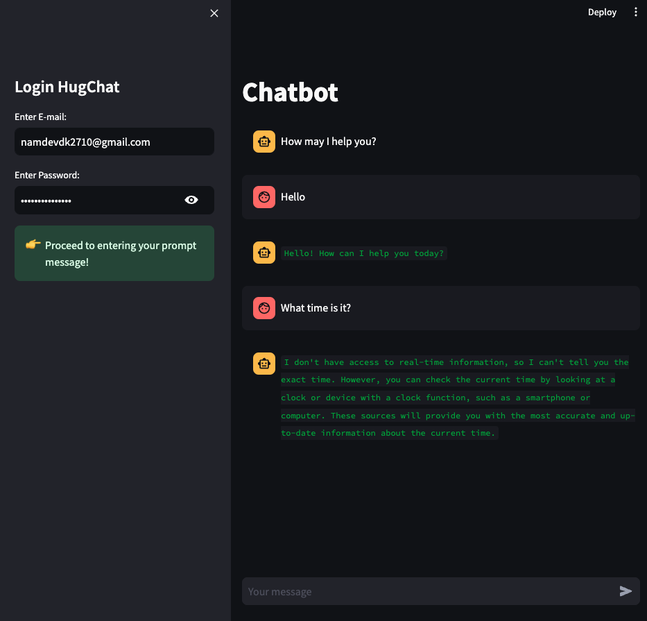

# Chatbot

The Chatbot project aims to enable smart conversations through cutting-edge natural language processing and machine learning. It's built to promptly and accurately process and answer user queries. This technology is essential for applications like automated customer support, virtual assistants, and interactive entertainment, where effective and natural dialogue is crucial.

## Table of Contents

1. [Introduction](#introduction)
2. [Installation](#installation)
3. [Demo](#demo)

## Introduction

This project focuses on creating AI-powered chatbot applications using Hugging Face, an innovative platform that simplifies the development and deployment of chatbots equipped with advanced natural language processing capabilities. At the heart of this project is a chatbot application that employs cutting-edge NLP models and machine learning techniques from Hugging Face to accurately understand, interpret, and respond to user inquiries in real-time. This functionality is crucial for various applications, including automated customer support, virtual personal assistants, and interactive entertainment, where immediate and accurate text-based communication is key.

## Installation

To run these applications locally, follow these steps:

1. Clone this repository:

```bash
git clone https://github.com/namdevdk2710/chatbot.git
cd object-detection
```

2. Install the required dependencies:

```bash
pip install -r requirements.txt
```

3. Run the applications using Streamlit:

```bash
streamlit run main.py
```

## Demo

<p align='center'>
  
</p>
